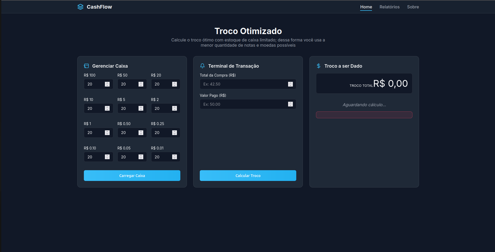
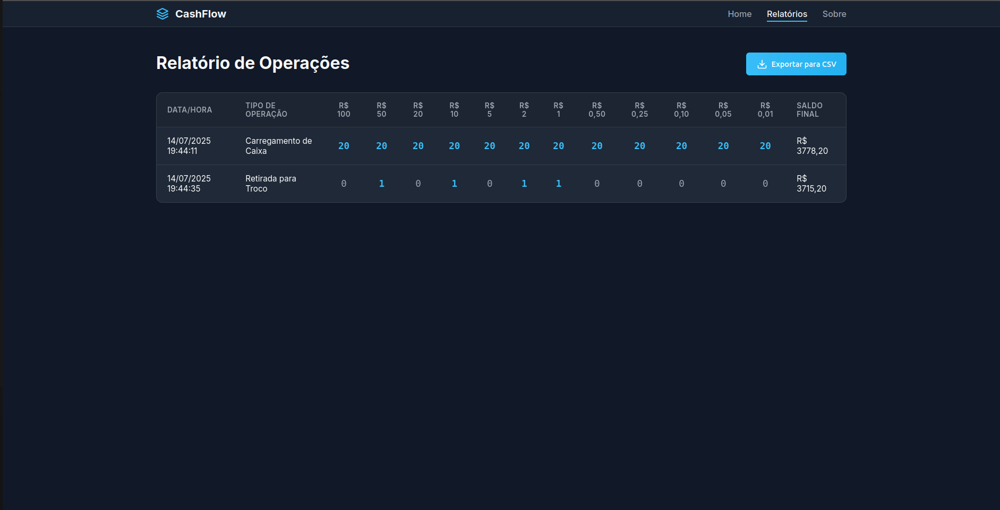

# CashFlow

**Conteúdo da Disciplina**: PD - Programação Dinâmica 

## Alunos
|Matrícula | Aluno |
| -- | -- |
| 22/2037737  |  Matheus de Siqueira Brant |
| 22/2031045  |  Caio Magalhães Lamego |

## Sobre 
O CashFlow é um simulador de caixa desenvolvido em Flask que permite calcular o troco ideal com base no estoque real de notas e moedas. O sistema registra carregamentos e retiradas, gera relatórios e exporta os dados em CSV. Seu diferencial está no uso de programação dinâmica para resolver o Problema do Troco com Moedas Limitadas, buscando a menor quantidade possível de cédulas. A interface é feita com HTML, CSS e JavaScript, oferecendo navegação entre painéis de controle, transações e histórico. O algoritmo central considera combinações viáveis de notas dentro do estoque disponível. É um projeto prático com foco em algoritmos aplicados ao mundo real.

## Screenshots

## Instalação 
**Linguagem (Algoritmo e Server)**: Python 3.10.12 
**Linguagem (FrontEnd)**: HTML5, CSS3 e JS 

**Pré-requisitos para rodar o seu projeto e os comandos necessários**:

- Ter pelo menos a versão Python 3.10.12 instalada em sua máquina.
- Acesse o diretório do projeto
- Se necessário ative o ambiente virtual 
    - python -m venv .venv  
    - source .venv/bin/activate 
- Instale as dependências 
    - pip install -r requirements.txt
-   rode o comando python3 app.py 
-   Acesse o localhost da porta 5000 (visível no terminal)

## Uso 
- Gerenciar Caixa: informe as quantidades de cédulas disponíveis.
- Terminal de Transação: insira o valor da compra e o valor pago.
- Troco Otimizado: veja a combinação ideal de troco com menor número de notas/moedas.
- Relatórios: visualize e exporte o histórico de operações em CSV.

## Video Apresentação 

https://youtu.be/FERVXiwSqEg

